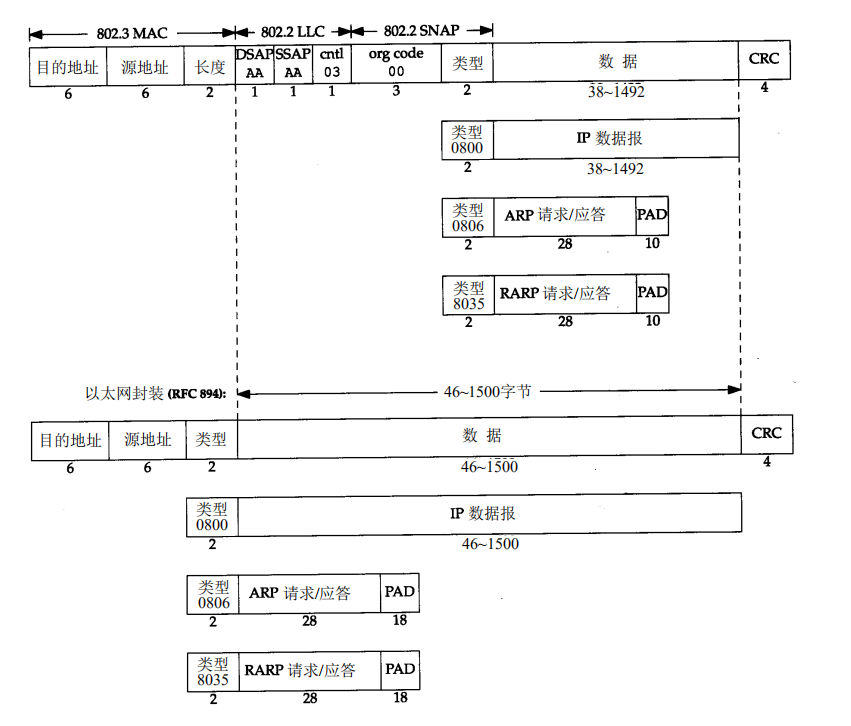
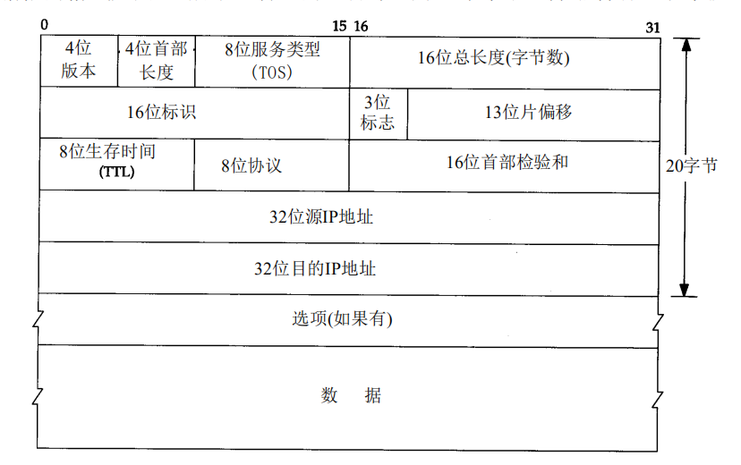
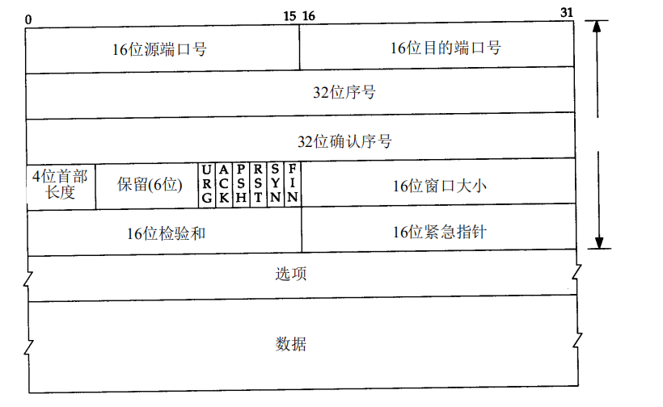

## 数据包

```shell
//wireshark 抓到一个TCP数据包
44 c7 fc 24 fc 12 00 cf e0 4d 04 41 08 00 45 00
01 4c 4f 8d 40 00 80 06 c4 20 c0 a8 02 0f b7 24
6c 22 d7 71 8f 50 fc de 37 47 d6 88 f5 3f 50 18
80 00 b7 3f 00 00 00 0a 1b 16 00 38 52 00 00 00
01 24 00 00 0a eb b4 cf 1b 00 00 00 00 70 ec 3e
d4 7a 1a 86 25 78 dc 58 a6 44 f7 57 a0 03 00 01
00 00 00 00 00 00 00 00 00 00 00 00 00 00 49 34
8a 97 40 8d 34 84 4f 5a f5 60 43 44 d2 3b a1 ca
0d 5a 69 93 25 cf 4b a7 db 32 37 b2 c8 7d 8c c3
db 5e 04 95 1e 86 e3 81 b0 57 3b f6 4a e5 68 39
bc 2d ab b2 87 eb d2 df c3 f6 04 b2 85 8e 49 79
62 a5 88 87 5e c5 62 ff b1 6c a7 a7 70 c0 97 ab
14 3a 41 cc 8f 93 a8 81 fd 5e 04 77 f2 d5 6f 14
0f 61 f0 21 a1 5d a0 20 82 c5 6a d3 44 4c 2d dc
14 9c 4a d1 ae ef 0d 80 a3 01 c4 f8 2e 05 c0 84
04 a7 f6 16 0c c2 5e 0e 09 01 af cd a9 0e 61 e7
ae 6a 51 6e 5c bb aa 9b d8 e9 33 d7 1e f6 c7 a5
20 56 3b b4 f7 c9 19 0b 3e e3 41 04 39 65 36 61
5a 7b 7b df 17 e4 e5 13 6c 02 7c aa 0b 57 57 d7
75 7a 0a 52 60 d1 4c 22 b3 a6 cd 13 b7 0d 47 a5
66 c5 63 b8 d7 d2 97 6f fc e7 93 30 3a 59 ed 57
3c 1a 55 1b e4 44 23 f3 6a fa
```

## 1. 链路层

    ip数据头(14=6+6+2) + IP 数据包 + CRC
    目的地址-6+源地址-6+类型-2 + 数据包 + CRC-4 (此处的地址指的是物理地址)

```sh
#44 c7 fc 24 fc 12 00 cf e0 4d 04 41 08 00
44 c7 fc 24 fc 12 目的物理地址
00 cf e0 4d 04 41 源物理地址
08 00 			  类型(0800 IP协议-除此之外还有ICMP,IGMP)
```

    CRC字段(或FCS)帧检验序列,是一个循环冗余检验码, 以检测数据帧中的错误。

## 2. 网络层(IP 层)

```shell
#45 00 01 4c 4f 8d 40 00 80 06 c4 20 c0 a8 02 0f b7 24 6c 22
45 	 	前4bit代表版本(4,代表IPv4),后4bit代表TCP首部长度 首部长度20字节
00   		8bit 服务类型
01 4c 		16bit 总长度 223  IP数据包的总长度(链路层的数据不包括, IP首部)
4f 8d 		16位标识 (1)
40 00		3位标志(2), 13位片偏移
80 		8bit 生存时间
06 		8bit 协议, 06代表TCP协议
c4 20		16bit首部校验和(3)
c0 a8 02 0f  	32bit 源IP地址
b7 24 6c 22	32bit 目的IP地址
```

(1) 16 位标识: IP 软件在存储器中维持一个计数器，每产生一个数据报，计数器就加 1，并将此值赋给标识字段。但这个“标识”不是序号，因为 IP 是无连接服务，数据报不存在按序接收的问题。当数据报由于长度超过网络的 MTU 而必须分片时，这个标识字段的值就被复制到所有的数据报片的标识字段中。相同的标识字段的值使分片后的各数据报片最后能正确地重装成为原来的数据报此处值为 0x1fd6

(2) 标志字段中的最低位为 MF（More Fragment）。MF=1 即表示后面“还有分片”的数据报。MF=0 表示这已是若干数据报片中的最后一个。标志字段中间的一位记为 DF（Don't Fragment），意思是“不能分片”。只有当 DF=0 时才允许分片。

(3) 在发送数据时，为了计算 IP 数据包的校验和。应该按如下步骤：
（1）把 IP 数据包的校验和字段置为 0；
（2）把首部看成以 16 位为单位的数字组成，依次进行二进制反码求和；
（3）把得到的结果存入校验和字段中。
在接收数据时，计算数据包的校验和相对简单，按如下步骤：
（1）把首部看成以 16 位为单位的数字组成，依次进行二进制反码求和，包括校验和字段；
（2）检查计算出的校验和的结果是否等于零（反码应为 16 个 0）；
（3）如果等于零，说明被整除，校验和正确。否则，校验和就是错误的，协议栈要抛弃这个数据包。

## 3. 运输层

     TCP 包

    ```shell
    #d7 71 8f 50 fc de 37 47 d6 88 f5 3f 50 18 80 00 b7 3f 00 00
    d7 71 		16bit 源端口号, 所以端口号范围0`65535
    8f 50		16bit 目的端口号
    fc de 37 47 32bit 序列号
    d6 88 f5 3f 32bit 确认序列号
    50 18		前4bit首部长度, 中间6bit保留位, 后6位 URG,ACK,PSH,RST,SYN,FIN(1)
    80 00		16bit 窗口大小
    b7 3f		16bit 校验和
    00 00		16bit 紧急指针
    ```

    (1)  SYN : 建立连接, FIN:关闭连接, ACK:响应, PSH:有data传输, RST:连接重置, URG 紧急位,数据优先处理

    (3) 握手-3: 1.客户端发起SYN连接,  2. 服务端对SYN连接做出ACK, 3. 客户端发送对服务端的ACK的ACK(响应)

    (4) 挥手-4: 1.客户端发送FIN, 2.服务端响应, 3.服务端FIN, 4.客户端响应  **发送FIN处于半关闭状态

## 附录:

**链路层**

> 头部 14 字节, 尾部 4 字节



**网络层(IP 层)**

> 头部 20 字节



**运输层(TCP)**

> 头部 20 字节


