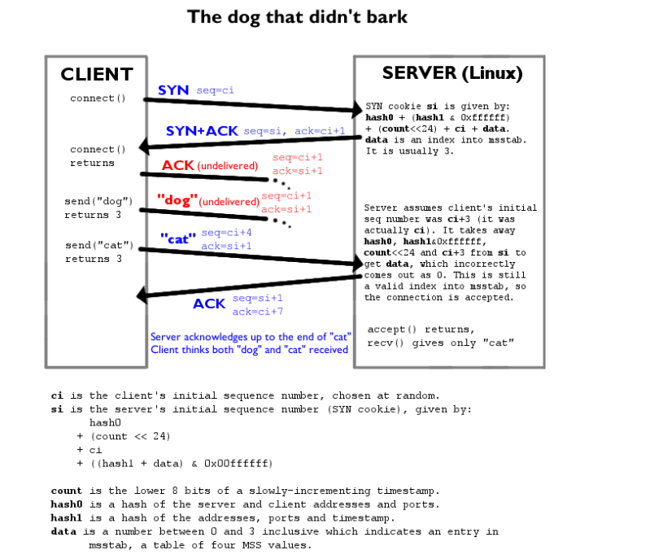

## TCP 和 UDP 原理视频

https://www.bilibili.com/video/av79717533?p=5

## TCP 抓包名词解释与逻辑图

SYN: 表示建立连接，
FIN: 表示关闭连接，
PSH: 表示有 DATA 数据传输，

RST 表示连接重置。
Seq: 序号
Ack: 应答序号, 表示响应
Win: 接收窗口  
len: 发送数据包的长度

## http 协议抓包

## 应用层到链路层的封装

