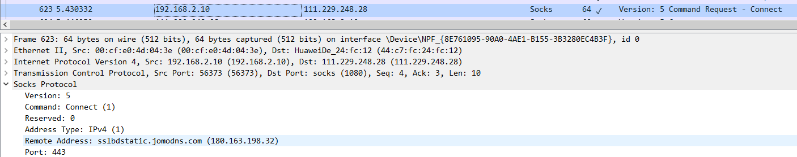
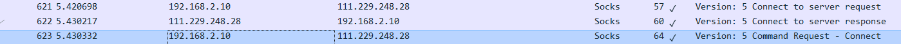

### socks5

1. 客户端请求连接,该数据包会带着 scoket 版本号
2. 服务端响应连接
3. 客户端提交要创建连接的目标服务器, 比如连接百度 www.baidu.com 第三个数据白会将这个包拿到服务端,代理服务会将这个请求和百度建立连接
4. 剩下的客户端和正常请求的数据包相差不大, 所有的数据包会把源 IP 修改为代理服务的 IP, 其它的没什么变化
5. 代理服务端将这些 TCP 包和 UDP 包修改 IP 后转发出去, 请求到数据以后在将数据包转发到客户端,客户端就可以正常上网
   

