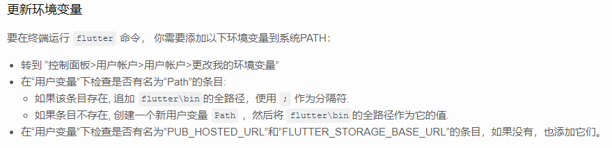
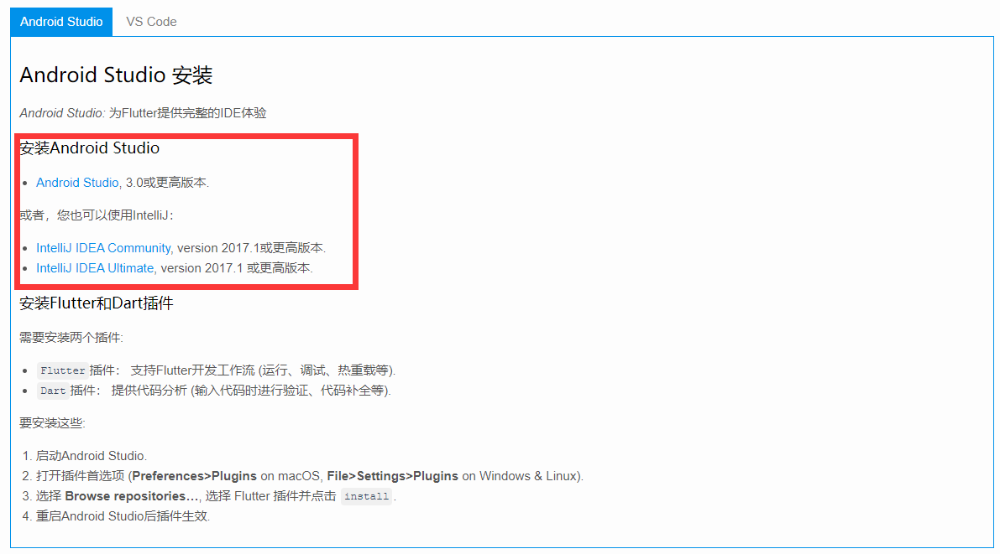
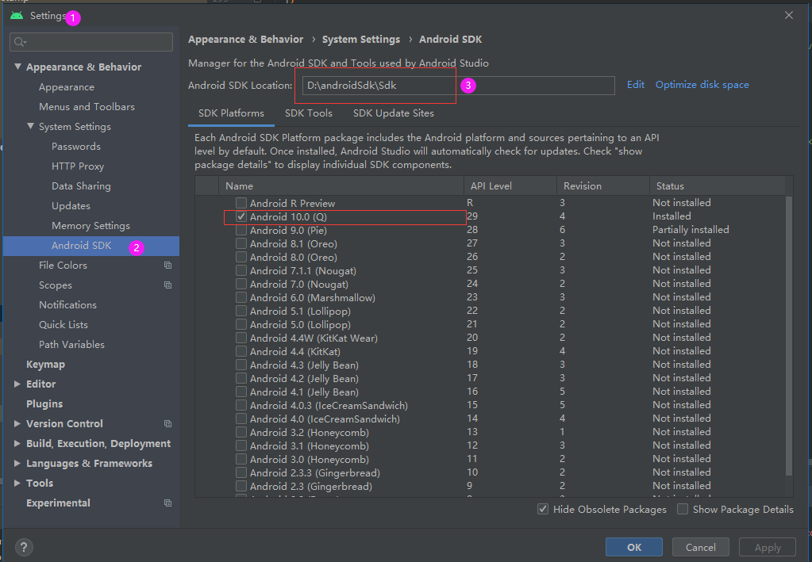
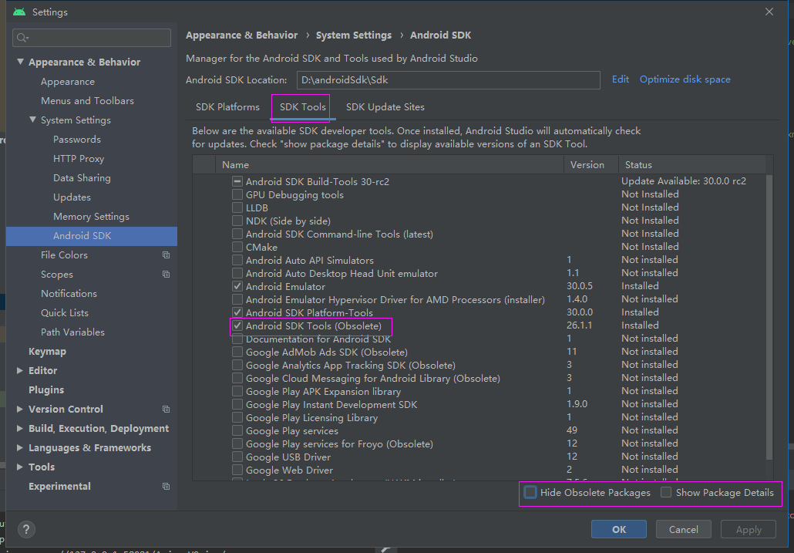
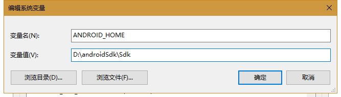
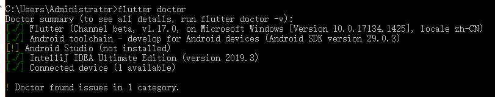
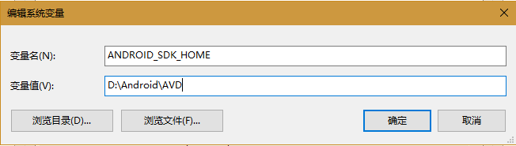

# flutter 环境搭建 --widows

### 1.安装flutter

>由于在国内访问Flutter有时可能会受到限制，Flutter官方为中国开发者搭建了临时镜像，大家可以将如下环境变量加入到用户环境变量中：
<div style="background:#D2EEFB;color:#01579B;font-size:15px;padding:10px;border-radius:10px;"><font color="red">注意:</font>此镜像为临时镜像，并不能保证一直可用，读者可以参考详情请参考[Using Flutter in China](https://github.com/flutter/flutter/wiki/Using-Flutter-in-China)以获得有关镜像服务器的最新动态。</div>

##### 环境配置:

```html
PUB_HOSTED_URL  https://pub.flutter-io.cn
FLUTTER_STORAGE_BASE_URL    https://storage.flutter-io.cn
```

### 2.下载 flutter 并配置全局变量flutter全局命令



### 3.下载 Dart 和 flutter 下载

>如果在安装了 IntelliJ IDEA 的情况下,优先使用它安装 Dart 和 Flutter 插件
>使用 Android Studio 安装Dart和flutter插件,虽然安装上了,但是运行flutter doctor 任仍然提示没有安装上



### 4.  安装 Android SDK
>1.先安装 Android Studio,然后打开 Android 配置 SDK 路径, 然后点击 ok


>然后安装 SDK tools


>配置 android sdk 的环境变量


>flutter doctor --android-licenses 一路执行 y
>运行 flutter -- flutter doctor 根据命令提示执行,


>到这一步环境就搭建完了, 可以使用 Android Studio 创建一个 flutter 项目,然后配置虚拟机, 就可以编写代码了

### 4.VSCode 配置 flutter

>[详情查看官网](https://flutterchina.club/get-started/test-drive/#vscode)
><font color='red'>注:</font>为了方便 VSCode 启动虚拟机 
>需要配置环境变量:



