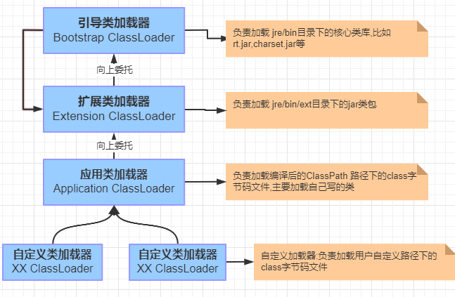

## 双亲委派机制


****
**具体流程**


****
## 代码实现自定义类加载器

```java
import java.io.*;
import java.lang.reflect.InvocationTargetException;
import java.lang.reflect.Method;

public class Index {

    public static void main(String[] args) throws ClassNotFoundException, IllegalAccessException, InstantiationException, NoSuchMethodException, InvocationTargetException {
        MyClassLoader loader1 = new MyClassLoader("E:\\ceshi\\");
        Class user = loader1.loadClass("com.han.User");
        Object o = user.newInstance();
        Method say = user.getDeclaredMethod("say", String.class);
        say.invoke(o,"你妹的");
        System.out.println(user.getClassLoader());

        MyClassLoader loader2 = new MyClassLoader("E:\\ceshi1\\");
        Class user2 = loader2.loadClass("com.han.User");
        Object o2 = user2.newInstance();
        Method say2 = user2.getDeclaredMethod("say", String.class);
        say2.invoke(o2,"它妹的");
        System.out.println(user2.getClassLoader());
    }

}


class MyClassLoader extends ClassLoader {

    private String classPath;

    public MyClassLoader(String classPath) {
        this.classPath = classPath;
    }

    @Override
    public Class<?> loadClass(String name) throws ClassNotFoundException {
        synchronized (getClassLoadingLock(name)) {
            // First, check if the class has already been loaded
            Class<?> c = findLoadedClass(name);
            if (c == null) {
                long t0 = System.nanoTime();
                if (c == null) {
                    // If still not found, then invoke findClass in order
                    // to find the class.
                    long t1 = System.nanoTime();
                    if(!name.startsWith("com.han"))
                    {
                        c = this.getParent().loadClass(name);
                    }else {
                        c = findClass(name);
                    }
//                    c = findClass(name);
                    // this is the defining class loader; record the stats
                    sun.misc.PerfCounter.getParentDelegationTime().addTime(t1 - t0);
                    sun.misc.PerfCounter.getFindClassTime().addElapsedTimeFrom(t1);
                    sun.misc.PerfCounter.getFindClasses().increment();
                }
            }

            return c;
        }
    }

    public Class findClass(String name) {
        byte[] b = new byte[0];
        try {
            b = loadClassData(name);
        } catch (IOException e) {
            e.printStackTrace();
        }
        return defineClass(name, b, 0, b.length);
    }

    /**
     * 将 .class文件加载到内存中
     * @param name
     * @return
     */
    private byte[] loadClassData(String name) throws IOException {
        String target = classPath + name.replace(".", "\\") + ".class";
        FileInputStream in = new FileInputStream(new File(target));
        int size = in.available();
        byte [] data = new byte[size];
        in.read(data);
        in.close();
        return data;
    }
}
```


***
## 为何不能在classPath 下命名 java.lang.Object
在 defineClass 类中调用了 preDefineClass 用来检测classPath下包名的命名规范, 如果是以 java. 开始的包都不会编译通过
