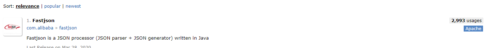
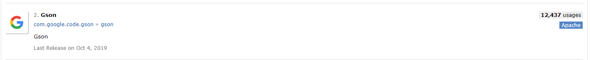
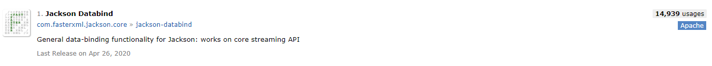

#mybatis中typeHandler自定义实现json操作
+ 自定义typeHander实现教程 https://blog.csdn.net/jokemqc/article/details/81326109 
+ 自定义typeHander实现JSON转化 https://blog.csdn.net/inflarunas/article/details/99588535
+ github提供 第三方对JSON操作的typeHander https://github.com/jneat/mybatis-gson
+ spring+mybatis中typehandler怎么配置 https://blog.csdn.net/zhaoyf7746/article/details/71131578

JSON 插件对比

