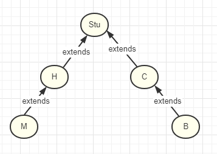

## 泛型
> 泛型指的是所有的类型都支持,但是不知道使用的时候具体用那一个类型,于是就有了泛型这个定义
其实很多类型,或是数据结构中都有泛型的存在,比如定义一个数据结构,它可以存储所有的类型,就可以使用泛型
``` java
/**
 * 定义一个盒子,
 * @param <T> T 是盒子里面装的东西的类型, 当然这个 T 是自定义的,也可以使用 E, C, AB 等
 */
public class Box <T> {
    private T t;
    
    public T getT() {
        return t;
    }

    public void setT(T t) {
        this.t = t;
    }
}
```
> 测试类 Index 

``` java
public class Index {

    public static void main(String[] args) {

        Box<String> box_str = new Box<>();
        box_str.setT("老鼠");

        Box<Stu> box_stu = new Box<>();
        box_stu.setT(new Stu_C());
    }
}
abstract class Stu {

}

class Stu_H extends Stu {

}

class Stu_C extends Stu {

}
```
## 类型通配符

类型通配符其实很好理解, 比如我有一个 泛型的 `Box<T>`, 现在我写一个方法, 专门处理 `Box<T>` 这个对象 

``` java
public static void test(Box box) {
    System.out.println(box.getT());
}

```

> 为了方便显示, 重写 Stu 的 `toString()` 方法

``` java
abstract class Stu {

    @Override
    public String toString() {
        return "Stu 的类型是: " + this.getClass().getSimpleName();
    }
}
```
> 测试代码

``` java
public static void main(String[] args) {

    Box<String> box_str = new Box<>();
    box_str.setT("老鼠");

    Box<Stu> box_stu = new Box<>();
    box_stu.setT(new Stu_C());

    Box<Stu> box_stu1 = new Box<>();
    box_stu1.setT(new Stu_H());

    test(box_str);   // 1
    test(box_stu);   // 2
    test(box_stu1);  // 3
}

// Box<?> 其实跟不加 <?> 没什么区别
public static void test(Box<?> box) {
    System.out.println(box.getT());
}
```

> 但是有的时候我们只处理 盒子里面只装了 Stu 这类型的, 就可以这样写
如果这样子写, `//1` 处就会报错 

``` java
public static void test(Box<? extends Stu> box) {
    System.out.println(box.getT());
}

//或者是
public static void test(Box<? super Stu> box) {
    System.out.println(box.getT());
}
``` 

给出以下测试

类结构


``` java
    /**
     * 这里主要看 Box<T> 箭括号里面的类型, 置于new 出来的是啥, extends, super 并筛选不掉
     *  ? extends Stu_H  只支持 Stu_H 和 Stu_H 的子类的类型
     *  ? super Stu_M    只支持 Stu_M 的和 Stu_M 父类,超类的类型,
     *      注意第二种情况, 如果使用一下方式new 出来的, test(box_stu_c) 并不会报错
     *          Box<Stu> box_stu_c = new Box<>();
     *          box_stu_c.setT(new Stu_C());
     */
    public static void test(Box<? super Stu_M> box) {
        System.out.println(box.getT());
    }
```
