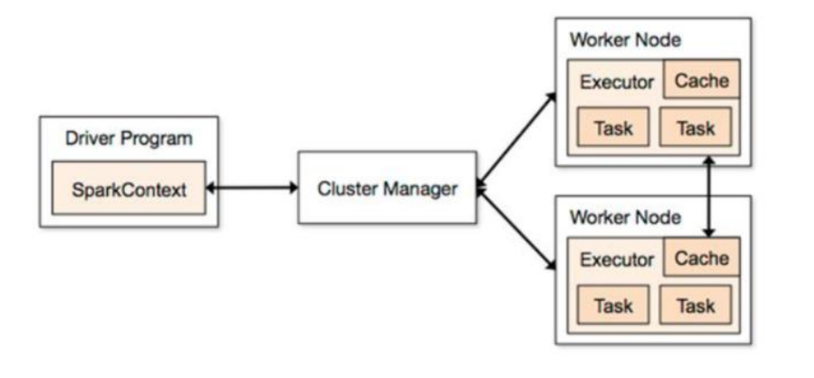

## spark

### setMaster

> 本地模式
>
> + local: 只启动一个 executor
> + local[num] : 启动 num 个 executor
> + local[*]: 启动跟 cpu 相同的核数 executor
> 

> 踩过的坑: 如果使用local[num] 的时候, 我在`本地数据清洗入库` 的时候,导致数据只写一半左右,然而 executor 还在执行中,一直没有结束的现象,但是库中的数据

