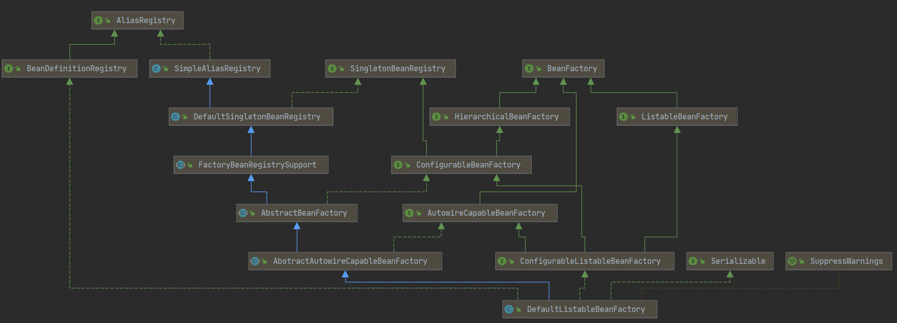

# getBean 的实现

**问题 1 : getBean 是BeanFactory 接口中的方法, 最后怎么调用到了`AbstractBeanFactory`类中的getBean的方法?**
> [DefaultListableBeanFactory.java](./code/DefaultListableBeanFactory.java) getBean

**问题 2 : getBean 是如何将类的字符串转化对应的类的**

