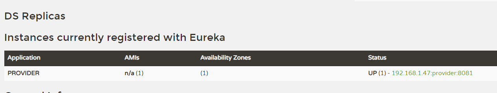

###  创建maven项目
+ 添加依赖

```XML
 <!-- spring boot 框架配置 -->
  <parent>
    <groupId>org.springframework.boot</groupId>
    <artifactId>spring-boot-starter-parent</artifactId>
    <version>2.0.7.RELEASE</version>
    <relativePath/> <!-- lookup parent from repository -->
  </parent>
  
  <dependencies>
    <dependency>
      <groupId>org.springframework.boot</groupId>
      <artifactId>spring-boot-starter-web</artifactId>
    </dependency>

    <!-- JDK 9 以上需要添加以下 -->
<!--        <dependency>-->
<!--            <groupId>javax.xml.bind</groupId>-->
<!--            <artifactId>jaxb-api</artifactId>-->
<!--            <version>2.3.0</version>-->
<!--        </dependency>-->
<!--        <dependency>-->
<!--            <groupId>com.sun.xml.bind</groupId>-->
<!--            <artifactId>jaxb-impl</artifactId>-->
<!--            <version>2.3.0</version>-->
<!--        </dependency>-->
<!--        <dependency>-->
<!--            <groupId>com.sun.xml.bind</groupId>-->
<!--            <artifactId>jaxb-core</artifactId>-->
<!--            <version>2.3.0</version>-->
<!--        </dependency>-->
<!--        <dependency>-->
<!--            <groupId>javax.activation</groupId>-->
<!--            <artifactId>activation</artifactId>-->
<!--            <version>1.1.1</version>-->
<!--        </dependency>-->
  </dependencies>
  
  <dependencyManagement>
    <dependencies>
      <dependency>
        <groupId>org.springframework.cloud</groupId>
        <artifactId>spring-cloud-depedencies</artifactId>
        <version>Finchley.SR2</version>
        <type>pom</type>
        <scope>import</scope>
      </dependency>
    </dependencies>
  </dependencyManagement>
```

> 在当前项目下创建 module 

添加 注册组件的 依赖

```XML
  <dependencies>
    <!-- https://mvnrepository.com/artifact/org.springframework.cloud/spring-cloud-starter-netflix-eureka-server -->
    <dependency>
      <groupId>org.springframework.cloud</groupId>
      <artifactId>spring-cloud-starter-netflix-eureka-server</artifactId>
      <version>2.0.2.RELEASE</version>
    </dependency>
  </dependencies>
```

在eureka module下资源文件中新建 application.yml, 并添加以下配置

```yml
server:
  port: 8081 #当前eureka 服务端口
eureka:
  client:
    register-with-eureka: false   #是否将自己注册为服务
    fetch-registry: false #将其他为服务数据同步
    service-url: #服务访问端口
      defaultZone:http://localhost:8081/eurka/
```


### 注册中心 eureka


> 添加启动类 EurkaServer

```java
package com.han;

import org.springframework.boot.SpringApplication;
import org.springframework.boot.autoconfigure.SpringBootApplication;
import org.springframework.cloud.netflix.eureka.server.EnableEurekaServer;

@SpringBootApplication
@EnableEurekaServer
public class EurkaServer {
    public static void main(String[] args) {
        SpringApplication.run(EurkaServer.class,args);
    }
}

```
> 点击运行时报错

javax.servlet.ServletContext.getVirtualServerName()Ljava/lang/String;
解决方案: 添加以下依赖

```xml
<!--    只有3.1.0 版本的才有这个getVirtualServerName 方法, 负责会报错:javax.servlet.ServletContext.getVirtualServerName()Ljava/lang/String; -->
<dependency>
    <groupId>javax.servlet</groupId>
    <artifactId>javax.servlet-api</artifactId>
    <version>3.1.0</version>
    <scope>provided</scope>
</dependency>
```

> 访问验证

http://localhost:8081/


### 服务提供者 EurekaClient 

> 创建Module, pom.xml 

```xml
<dependencies>
    <dependency>
        <groupId>org.springframework.cloud</groupId>
        <artifactId>spring-cloud-starter-netflix-eureka-client</artifactId>
        <version>2.0.2.RELEASE</version>
    </dependency>
</dependencies>
```

> 在资源文件中创建application.yml 文件

```yml
server:
  port: 8081
spring:
  application:
    name: provider   #当前服务注册在 Eureka Server 的名称
eureka:
  client:
    service-url:
      defaultZone: http://localhost:8761/eureka/

  instance:
    prefer-ip-address: true    # 是否将当前的服务ip注册到
```

> 创建启动类

```java
package com.han;

import org.springframework.boot.SpringApplication;
import org.springframework.boot.autoconfigure.SpringBootApplication;

@SpringBootApplication
public class EureKaClient {
    public static void main(String[] args) {
        SpringApplication.run(EureKaClient.class,args);
    }
}
```

> 启动之后



> 添加实体类 Student 和 StudentController
>
> 可以引入lombok 组件

```java
package com.han.bean;

import lombok.AllArgsConstructor;
import lombok.Data;
import lombok.NoArgsConstructor;

@AllArgsConstructor
@Data
@NoArgsConstructor
public class Student {
    private String name;
    private int age;
    private String sex;
}
```

```java
package com.han.controller;

import com.han.bean.Student;
import org.springframework.beans.factory.annotation.Value;
import org.springframework.web.bind.annotation.*;

import java.util.Collection;
import java.util.HashMap;
import java.util.Map;

@RestController
public class StudentController {

    @Value("${server.port}")
    private String Port;

    private static Map<Long, Student> studentMap = new HashMap();
    static {
        studentMap.put(1L,new Student("张三",18,"男"));
        studentMap.put(2L,new Student("李四",20,"女"));
        studentMap.put(3L,new Student("王五",19,"男"));
    }

    @GetMapping("/findAll")
    public Collection<Student> findAll(){
        return studentMap.values();
    }

    @GetMapping("/findById/{id}")
    public Student findById(@PathVariable("id") long id){
        return studentMap.get(id);
    }

    @PostMapping("/save")
    public void save(@RequestBody Student student){
        studentMap.put(4L,student);
    }

    @GetMapping("/index")
    public String index(){
        return Port;
    }
}
```


### 服务消费者 consumer

> 创建module  consumer 并添加依赖

```xml
<dependencies>
    <dependency>
        <groupId>org.springframework.cloud</groupId>
        <artifactId>spring-cloud-starter-netflix-eureka-client</artifactId>
        <version>2.0.2.RELEASE</version>
    </dependency>
</dependencies>
```

添加配置

```yml
server:
  port: 8070
spring:
  application:
    name: consumer
eureka:
  client:
    service-url:
      defaultZone: http://localhost:8761/eureka/

  instance:
    prefer-ip-address: true
```

> 添加启动类

```java
package com.han;

import org.springframework.boot.SpringApplication;
import org.springframework.boot.autoconfigure.SpringBootApplication;
import org.springframework.context.annotation.Bean;
import org.springframework.web.client.RestTemplate;

@SpringBootApplication
public class ConsumerController {
    public static void main(String[] args) {
        SpringApplication.run(ConsumerController.class,args);
    }

    @Bean
    public RestTemplate restTemplate(){
        return new RestTemplate();
    }
}
```

> 创建 Student 实体类

```java
package com.han.bean;

import lombok.AllArgsConstructor;
import lombok.Data;
import lombok.NoArgsConstructor;

@AllArgsConstructor
@Data
@NoArgsConstructor   //生成一个无参数构造方法
public class Student {
    private String name;
    private int age;
    private String sex;
}
```

> 创建 StudentController

```java
package com.han.controller;

import com.han.bean.Student;
import org.springframework.beans.factory.annotation.Autowired;
import org.springframework.web.bind.annotation.*;
import org.springframework.web.client.RestTemplate;

import java.util.Collection;

@RestController
public class StudentController {

    @Autowired
    private RestTemplate restTemplate;

    private final static String url = "Http://192.168.1.47:8083/";

    @GetMapping("/findAll")
    public Collection<Student> findAll(){
        return restTemplate.getForEntity(url + "findAll", Collection.class).getBody();
    }

    @GetMapping("/findById/{id}")
    public Student findById(@PathVariable("id") long id){
        return restTemplate.getForEntity(url + "findById/{id}",Student.class,id).getBody();
    }

    @PostMapping("/save")
    public void save(@RequestBody Student student){
        restTemplate.postForEntity(url + "save",student,null);
    }

    @PostMapping("/save2")
    public void save2(@RequestBody Student student){
        restTemplate.postForObject(url + "save",student,null);
    }

}
```


### zuul 服务网关

Spring Cloud 集成了Zuul 组件,实现服务网管

> Zuul是Netlix提供的-个开源的API网关服务器，是客户端和网站后端所有请求的中间层，对外开放的API,将所有请求导入统-一的入口，屏蔽了服务端的具体实现逻辑，Zuul 可以实现反向代理的功能，在网关内部实现动态路由、身份认证、IP 过滤、数据监控等。

> 创建module -> zuul 添加依赖 和配置如下

消费者访问服务提供者接口 需要经过这个网关, 相当于中间件,提供统一入口

```xml
<dependencies>
    <dependency>
        <groupId>org.springframework.cloud</groupId>
        <artifactId>spring-cloud-starter-netflix-eureka-client</artifactId>
        <version>2.0.2.RELEASE</version>
    </dependency>

    <dependency>
        <groupId>org.springframework.cloud</groupId>
        <artifactId>spring-cloud-starter-netflix-zuul</artifactId>
        <version>2.0.2.RELEASE</version>
    </dependency>

</dependencies>
```

```xml
server:
  port: 8021
spring:
  application:
    name: agteway
eureka:
  client:
    service-url:
      defaultZone: http://localhost:8761/eureka
zuul:
  routes:
    provider: /p/**
```

> 启动类创建

```java
package com.han;

import org.springframework.boot.SpringApplication;
import org.springframework.boot.autoconfigure.EnableAutoConfiguration;
import org.springframework.cloud.netflix.zuul.EnableZuulProxy;

@EnableZuulProxy  //包含了 @EnableZuulServer 设置该类是网关的启动类
@EnableAutoConfiguration //可以帮助SpringBoot 应用将所有符合条件的 @Configuration 配置加载到当前SpringBoot 创建并使用的 IOC 容器中
public class ZuulServer {
    public static void main(String[] args) {
        SpringApplication.run(ZuulServer.class,args);
    }
}
```

+ <b>Zuul</b> 自带负载均衡功能,

1. 修改 provider 代码,新建启动类,修改端口并并启动

2. 使用网关访问接口端口的访问,每次返回的端口不一样,两个交替执行


### Ribbon 负载均衡

+ Ribbon 

> + Spring Cloud Ribbon 是-个负载均衡解决方案, Ribbon 是Netfix发布的负载均衡器, Spring Cloud Ribbon是基于Netflix Ribbon实现的，是一个用于对HTTP请求进行控制的负载均衡客户端。
> + 在注册中心对Ribbon进行注册之后，Ribbon 就可以基于某种负载均衡算法，如轮询、随机、加权轮询、加权随机等自动帮助服务消费者调用接口，开发者也可以根据具体需求自定义Ribbon负载均衡算法。实际开发中,Spring Cloud Ribbon需要结合 <b>Spring Cloud Eureka </b>来使用，Eureka Server提供所有可以调用的服务提供者列表，Ribbon基于特定的负载均衡算法从这些服务提供者中选择要调用的具体实例。

创建module 添加配置

```yml
server:
  port: 8040
spring:
  application:
    name: ribbon
eureka:
  client:
    service-url:
      defaultZone: http://localhost:8761/eureka/

  instance:
    ip-address: true
```


添加启动类

```java
package com.han;

import org.springframework.boot.SpringApplication;
import org.springframework.boot.autoconfigure.SpringBootApplication;
import org.springframework.cloud.client.loadbalancer.LoadBalanced;
import org.springframework.context.annotation.Bean;
import org.springframework.web.client.RestTemplate;

@SpringBootApplication
public class RibbonServer {
    public static void main(String[] args) {
        SpringApplication.run(RibbonServer.class,args);
    }

    @Bean
    @LoadBalanced //负载浚航注解
    public RestTemplate restTemplate(){
        return new RestTemplate();
    }
}
```


```java
package com.han.controller;

import com.han.bean.Student;
import org.springframework.beans.factory.annotation.Autowired;
import org.springframework.web.bind.annotation.*;
import org.springframework.web.client.RestTemplate;

import java.util.Collection;

@RestController
public class StudentController {

    @Autowired
    private RestTemplate restTemplate;
	
    //这里使用的是 provider 服务者提供者注册的名称     
    //必须在启动类中注解 @LoadBalanced 服务提供者的名称才会被解析成相应的 服务提供者的地址
    private final static String url = "Http://provider/";

    @GetMapping("/findAll")
    public Collection<Student> findAll(){
        return restTemplate.getForEntity(url + "findAll", Collection.class).getBody();
    }

    @GetMapping("/findById/{id}")
    public Student findById(@PathVariable("id") long id){
        return restTemplate.getForEntity(url + "findById/{id}",Student.class,id).getBody();
    }

    @PostMapping("/save")
    public void save(@RequestBody Student student){
        restTemplate.postForEntity(url + "save",student,null);
    }

    @PostMapping("/save2")
    public void save2(@RequestBody Student student){
        restTemplate.postForObject(url + "save",student,null);
    }


    @GetMapping("/index")
    public String index(){
        return restTemplate.getForEntity(url + "index", String.class).getBody();
    }
}
```


### feign (整合了 zuul,Ribbon,RestTemplate)

+ 什么是 feign

1. 与Ribbon-样，Feign 也是由Netflix 提供的，Feign 是-个声明式、模版化的Web Service客户端，它简化了开发者编写Web服务客户端的操作,开发者可以通过简单的接口和注解来调用HTTP API, Spring Cloud Feign,它整合了Ribbon和Hystrix,具有可插拔、基于注解、负载均衡、服务熔断等一系列便捷功能。

2. 相比较于Ribbon + RestTemplate的方式，Feign 大大简化了代码的开发，Feign 支持多种注解，包括Feign注解、JAX-RS注解、Spring MVC注解等，Spring Cloud对Feing进行了优化,整合了Ribbon和Eureka,从而让Feign的使用更加方便。

+ feign 和 ribbon 区别

Ribbon 是一个通用的HTTP客户端工具, Feign 是基于 Ribbon

+ feign 的 特点

1. Feign 是一个声明式的 Web Service 客户端
2. 支持Feign 注解, Spring MVC 注解, JAX-RS 注解
3. Feign 基于Ribbon 实现,使用起来更加简单
4. Feign 集成了 Hystrix, 具备服务器熔断的功能

+ 创建 modle, pom 文件

  ```xml
  <dependency>
      <groupId>org.springframework.cloud</groupId>
      <artifactId>spring-cloud-starter-netflix-eureka-client</artifactId>
      <version>2.0.2.RELEASE</version>
  </dependency>
  <dependency>
      <groupId>org.springframework.cloud</groupId>
      <artifactId>spring-cloud-starter-openfeign</artifactId>
      <version>2.0.2.RELEASE</version>
  </dependency>
  ```

+ 添加配置文件

  ```yml
  server:
    port: 8050
  spring:
    application:
      name: feign
  eureka:
    client:
      service-url:
        defaultZone: http://localhost:8761/eureka/
    instance:
      prefer-ip-address: true
  
  # 开启熔断机制
  feign:
    hystrix:
      enabled: true
  
  ```

+ 启动类

  ```java
  package com.han;
  
  import org.springframework.boot.SpringApplication;
  import org.springframework.boot.autoconfigure.SpringBootApplication;
  import org.springframework.cloud.openfeign.EnableFeignClients;
  
  @SpringBootApplication
  @EnableFeignClients
  public class FeginServer {
      public static void main(String[] args) {
          SpringApplication.run(FeginServer.class,args);
      }
  }
  ```

+ 创建声明式接口

  ```java
  package com.han.feign;
  
  import com.han.bean.Student;
  import org.springframework.cloud.openfeign.FeignClient;
  import org.springframework.web.bind.annotation.GetMapping;
  
  import java.util.Collection;
  
  @FeignClient(value = "provider")
  public interface StudentFeign {
      @GetMapping("/findAll")
      Collection<Student> findAll();
  
      @GetMapping("/index")
      String index();
  }
  ```


+ 熔断机制:

  配置问价中添加属性 	feign.hystrix.enabled: true

  添加类  继承 StudentFeign 

  ```java
  package com.han.feign.feignImpl;
  
  import com.han.bean.Student;
  import com.han.feign.StudentFeign;
  import org.springframework.stereotype.Component;
  
  import java.util.Collection;
  
  @Component
  public class FeignError implements StudentFeign {
  
      @Override
      public Collection<Student> findAll() {
          return null;
      }
  
      @Override
      public String index() {
          return "服务器维护中...";
      }
  }
  
  ```

  然后再 StudentFeign 接口中 修改注解

  ```java
  @FeignClient(value = "provider",fallback = FeignError.class)
  ```


### Hystrix 容错机制

在不改变各个微服务调用关系的前提下,针对错误情况进行预先处理.

+ 设计原则
  1. 服务隔离机制
  2. 服务降级机制
  3. 熔断机制
  4. 提供实时监控和报警功能
  5. 提供实时的配置修改功能

Hystrix数据监控需要结合Spring Boot Actuator来使用，Actuator 提供了对服务的健康监控、数据统计，可以通过hystrix.stream节点获取监控的请求数据，提供了可视化的监控界面。

+ 创建 module ,添加依赖

  ```xml
  <dependencies>
      <dependency>
          <groupId>org.springframework.cloud</groupId>
          <artifactId>spring-cloud-starter-netflix-eureka-client</artifactId>
          <version>2.0.2.RELEASE</version>
      </dependency>
      <dependency>
          <groupId>org.springframework.cloud</groupId>
          <artifactId>spring-cloud-starter-openfeign</artifactId>
          <version>2.0.2.RELEASE</version>
      </dependency>
      <!-- 服务健康监控 --> 
      <dependency>
          <groupId>org.springframework.boot</groupId>
          <artifactId>spring-boot-starter-actuator</artifactId>
          <version>2.0.7.RELEASE</version>
      </dependency>
      <!-- hystrix -->
      <dependency>
          <groupId>org.springframework.cloud</groupId>
          <artifactId>spring-cloud-starter-netflix-hystrix</artifactId>
          <version>2.0.2.RELEASE</version>
      </dependency>
    	<!-- hystrix 监控可视化组件 -->  
      <dependency>
          <groupId>org.springframework.cloud</groupId>
          <artifactId>spring-cloud-starter-netflix-hystrix-dashboard</artifactId>
          <version>2.0.2.RELEASE</version>
      </dependency>
  </dependencies>
  ```

+ 添加配置文件 application.yml

  ```yml
  server:
    port: 8060
  spring:
    application:
      name: hystrix
  eureka:
    client:
      service-url:
        defaultZone: http://localhost:8761/eureka/
        
  #配置熔断机制
  feign:
    hystrix:
      enabled: true
  
  # 配置数据健康系统
  management:
    endpoints:
      web:
        exposure:
          include: 'hystrix.stream'
  ```

+ 创建启动类

  ```java
  package com.han;
  
  import org.springframework.boot.SpringApplication;
  import org.springframework.boot.autoconfigure.SpringBootApplication;
  import org.springframework.cloud.client.circuitbreaker.EnableCircuitBreaker;
  import org.springframework.cloud.netflix.hystrix.dashboard.EnableHystrixDashboard;
  import org.springframework.cloud.openfeign.EnableFeignClients;
  
  @SpringBootApplication
  @EnableFeignClients
  @EnableCircuitBreaker 
  @EnableHystrixDashboard
  public class HystrixServer {
      public static void main(String[] args) {
          SpringApplication.run(HystrixServer.class,args);
      }
  }
  ```

  > 注解说明

  `@EnableCircuitBreaker`:  声明数据监控

  `@EnableHystrixDashboard`: 声明启用可视化数据监控

  

+ 添加实体类 Students 和 StudentFeign ,

  ```java
  package com.han.feign;
  
  import com.han.bean.Student;
  import org.springframework.cloud.openfeign.FeignClient;
  import org.springframework.web.bind.annotation.GetMapping;
  
  import java.util.Collection;
  
  @FeignClient(value = "provider")
  public interface StudentFeign {
      @GetMapping("/findAll")
      Collection<Student> findAll();
  
      @GetMapping("/index")
      String index();
  }
  ```

+ 添加 HystrixController

  ```java
  package com.han.controller;
  
  import com.han.bean.Student;
  import com.han.feign.StudentFeign;
  import org.springframework.beans.factory.annotation.Autowired;
  import org.springframework.web.bind.annotation.GetMapping;
  import org.springframework.web.bind.annotation.RequestMapping;
  import org.springframework.web.bind.annotation.RestController;
  
  import java.util.Collection;
  
  @RestController
  @RequestMapping("/hystrix")
  public class HystrixController {
  
      @Autowired
      private StudentFeign studentFeign;
  
      @GetMapping("/findAll")
      public Collection<Student> findAll(){
          return studentFeign.findAll();
      }
  
      @GetMapping("/index")
      public String index(){
          return studentFeign.index();
      }
  
  }
  ```

+ 分别启动 服务提供者, 注册中心, 以及 HystrixServer 项目, 在浏览器中输入

  `@http://192.168.1.47:8060/actuator/hystrix.stream` 进行访问界面

+ 可视化数据配置

  > 访问 `http://192.168.1.47:8060/hystrix`
  >
  > 输入 `http://192.168.1.47:8060/actuator/hystrix.stream` 点击 `确定` 进入

### Spring Cloud 配置中心

Spring Cloud Config,通过服务端可以为多个客户端提供配置服务。Spring Cloud Config可以将配置文件存储在本地，也可以将配置文件存储在远程Git仓库,创建Config Server,通过它管理所有的配置文件。

> 本地文件系统

创建 ConfigServer module 

> 添加依赖

```xml
<dependencies>
    <dependency>
        <groupId>org.springframework.cloud</groupId>
        <artifactId>spring-cloud-config-server</artifactId>
        <version>2.0.2.RELEASE</version>
    </dependency>
</dependencies>
```

> 添加配置文件

```yml
server:
  port: 8762
spring:
  application:
    name: configServer
  profiles:
    active: native  #读取本地配置
  cloud:
    config:
      server:
        native:
          search-locations: classpath:/shared
```

> 启动类

```java
package com.han;

import org.springframework.boot.SpringApplication;
import org.springframework.boot.autoconfigure.SpringBootApplication;
import org.springframework.cloud.config.server.EnableConfigServer;

@SpringBootApplication
@EnableConfigServer //声明配置中心
public class ConfigServer {
    public static void main(String[] args) {
        SpringApplication.run(ConfigServer.class,args);
    }
}
```

> 创建 shared 目录,添加配置文件 configclient-dev.yml

```yml
server:
  port: 8070
foo: foo version
```

> 创建客户端 ConfigClient 读取配置文件,添加依赖

```yml
<dependencies>
    <dependency>
        <groupId>org.springframework.cloud</groupId>
        <artifactId>spring-cloud-config-server</artifactId>
        <version>2.0.2.RELEASE</version>
    </dependency>
</dependencies>
```

> 创建配置文件 `bootstrap.yml `(文件名不可更改),用来读取share中的配置
>
> 通过spring.application.name 和 spring.profiles.active 拼接起来的名称,在Config Server 中查找相应的配置

```yml
spring:
  application:
    name: configclient
  profiles:
    active: dev
  cloud:
    config:
      uri: http://localhost:8762  #配置本的 Config Server 的访问路径
      fail-fast: true  #设置判断Config Server 获取是否正常
```

> 创建 Controller 读取配置文件

```java
package com.han.controller;

import org.springframework.beans.factory.annotation.Value;
import org.springframework.web.bind.annotation.GetMapping;
import org.springframework.web.bind.annotation.RestController;

@RestController
public class ConfigClientController {

    @Value("${server.port}")
    private String port;

    @Value("${foo}")
    private String foo;

    @GetMapping("/index")
    public String index(){
        return this.port + "-->" + this.foo;
    }
}
```

> 启动之后访问 http://localhost:8070/index 显示配置

### Spring Colud 远程配置

> 创建配置文件并上传的github

```yml
server:
  port: 8070
eureka:
  client:
    serverUrl:
      defaultZone: http://localhost:8761/eureka/
spring:
  application:
    name: configclient
```

> 创建新的moudle ConfigServerY 	添加依赖

```xml
<dependencies>
    <dependency>
        <groupId>org.springframework.cloud</groupId>
        <artifactId>spring-cloud-config-server</artifactId>
        <version>2.0.2.RELEASE</version>
    </dependency>
</dependencies>
```

>创建配置文件 application.yml

```yml
server:
  port: 8888
spring:
  application:
    name: configserver
  cloud:
    config:
      server:
        git:
          uri: https://github.com/han-guang-xue/springbootcloud.git
          search-paths: config
          username: han-guang-xue
          password: root
      label: master
sureka:
  client:
    serviceUrl:
      defaultZone: http://localhost:8761/eureka/
```

> 创建新的moudel 作为客户端,添加依赖

```xml
<dependencies>
    <dependency>
        <groupId>org.springframework.cloud</groupId>
        <artifactId>spring-cloud-starter-config</artifactId>
        <version>2.0.0.RELEASE</version>
    </dependency>

    <dependency>
        <groupId>org.springframework.cloud</groupId>
        <artifactId>spring-cloud-starter-netflix-eureka-client</artifactId>
        <version>2.0.2.RELEASE</version>
    </dependency>
</dependencies>
```

> 创建配置文件bootstrap.yml 

```yml
spring:
  cloud:
    config:
      name: configclient  #远程配置文件中的配置文件名
      label: master	#git Repository 分支
      discovery:
        enabled: true #是否开启Config 服务发现支持.
        service-id: configserver  #配置中心名称
sureka:
  client:
    serviceUrl:
      defaultZone: http://localhost:8761/eureka/
```

### Zipkin 服务跟踪

Spring Cloud Zipkin

Zipkin是-个可以采集并且跟踪分布式系统中请求数据的组件，让开发者可以更加直观的监控到请求在各个微服务所耗费的时间等，Zipkin: Zipkin Server. Zipkin Client.

> 创建zipkin module  添加依赖

```xml
<dependencies>
    <dependency>
        <groupId>io.zipkin.java</groupId>
        <artifactId>zipkin-server</artifactId>
        <version>2.9.4</version>
    </dependency>
    <dependency>
        <groupId>io.zipkin.java</groupId>
        <artifactId>zipkin-autoconfigure-ui</artifactId>
        <version>2.9.4</version>
    </dependency>
</dependencies>
```

> 创建配置文件 application.yml

```yml
server:
  port: 9090
```

> 创建启动类

```java
package com.han;

import org.springframework.boot.SpringApplication;
import org.springframework.boot.autoconfigure.SpringBootApplication;
import zipkin.server.internal.EnableZipkinServer;

@SpringBootApplication
@EnableZipkinServer //声明启动 Zipkin
public class ZipkinServer {
    public static void main(String[] args) {
        SpringApplication.run(ZipkinServer.class,args);
    }
}
```

> 创建 ZipkinServer 客户端 module 添加依赖

```xml
<dependencies>
    <dependency>
        <groupId>org.springframework.cloud</groupId>
        <artifactId>spring-cloud-starter-zipkin</artifactId>
        <version>2.0.2.RELEASE</version>
    </dependency>
</dependencies>
```

> 添加 application.yml

```yml
server:
  port: 8090
spring:
  application:
    name: zipkinclient
  sleuth:
    web:
      client:
        enabled: true
    sampler:
      probability: 1.0
  zipkin:
    base-url: http://localhost:9090/
    
sureka:
  client:
    serviceUrl:
      defaultZone: http://localhost:8761/eureka/
```

> 属性
>
> `spring.sleuth.web.client.enabled`: 设置开启请求跟踪
>
> `spring.sleuth.samepler.probability`: 设置采样比例, 默认是1.0
>
> `spring.zipkin.base-url`:  Zipkin Server 地址


> 设置启动类

```java
package com.han;

import org.springframework.boot.SpringApplication;
import org.springframework.boot.autoconfigure.SpringBootApplication;

@SpringBootApplication
public class ZipkinClient {
    public static void main(String[] args) {
        SpringApplication.run(ZipkinClient.class,args);
    }
}
```

> 设置Controller

```java
package com.han.controller;

import org.springframework.beans.factory.annotation.Value;
import org.springframework.web.bind.annotation.GetMapping;
import org.springframework.web.bind.annotation.RestController;

@RestController
public class ZipkinController {
    @Value("${server.port}")
    private String port;

    @GetMapping("/index")
    public String index(){
        return this.port;
    }
}
```

> 启动之后访问 `Http:localhost:9090/zipkin`
> 访问接口 index 再次点击 `Find Traces`

