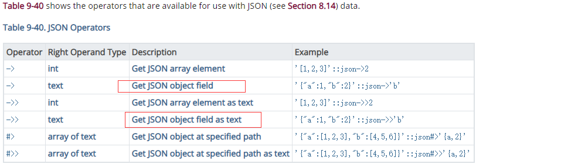
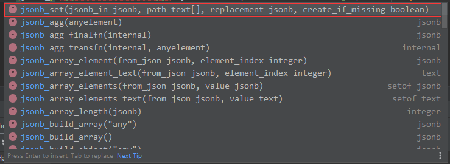

## json和jsonb 的区别

## postSql 对 json 和 jsonb 数据格式的操作
官方文档: https://www.postgresql.org/docs/9.3/functions-json.html;
         http://www.postgres.cn/docs/10/datatype-json.html#JSON-KEYS-ELEMENTS;

模糊查询:https://juejin.im/entry/586b448761ff4b00578c1b7a
####创建表

```sql
-- auto-generated definition
create table "UFriendsRelation"
(
	"UFID" serial not null,
	"UHashId" varchar,
	"UFriends" jsonb,
	"UGroupIds" json,
	"UFCreateTime" timestamp
);

comment on column "UFriendsRelation"."UFID" is '自增主键';

comment on column "UFriendsRelation"."UHashId" is '用户的唯一id';

comment on column "UFriendsRelation"."UFriends" is '好友
[{好友ID，好友名称，好友头像, 好友备注，关系}]';

comment on column "UFriendsRelation"."UGroupIds" is '用户所在的群组ID集合
[{组群ID，组群名称,群组头像}]';

comment on column "UFriendsRelation"."UFCreateTime" is '创建时间';

-- 插入数据
INSERT INTO public."UFriendsRelation" ("UFID", "UHashId", "UFriends", "UGroupIds", "UFCreateTime") VALUES (2, 'asdf', null, null, null);
INSERT INTO public."UFriendsRelation" ("UFID", "UHashId", "UFriends", "UGroupIds", "UFCreateTime") VALUES (1, 'asdfasdf', '[{"name": "张三"}]', '[{"name": "张三"}]', '2020-05-05 14:40:52.000000');
INSERT INTO public."UFriendsRelation" ("UFID", "UHashId", "UFriends", "UGroupIds", "UFCreateTime") VALUES (6, '123321', '[{"age": 18, "sex": true, "name": "张三"}, {"age": 18, "sex": true, "name": "李四"}]', '[{"sex":true,"name":"张三","age":18}]', '2020-05-06 10:52:01.946950');
INSERT INTO public."UFriendsRelation" ("UFID", "UHashId", "UFriends", "UGroupIds", "UFCreateTime") VALUES (4, '123321', '[{"age": 14, "sex": true}]', '[{"sex":true,"name":"张三","age":18},{"sex":true,"name":"李四","age":18}]', '2020-05-05 18:23:28.265772');
INSERT INTO public."UFriendsRelation" ("UFID", "UHashId", "UFriends", "UGroupIds", "UFCreateTime") VALUES (3, '123321', '[{"age": 12, "sex": true, "name": "张三"}]', '[{"sex":true,"name":"张三","age":18},{"sex":true,"name":"李四","age":18}]', '2020-05-05 18:07:16.485417');
INSERT INTO public."UFriendsRelation" ("UFID", "UHashId", "UFriends", "UGroupIds", "UFCreateTime") VALUES (7, '123321', '[{"age": 16, "sex": true, "name": "张三"}, {"age": 18, "sex": true, "name": "李四"}]', '[{"sex":true,"name":"张三","age":18}]', '2020-05-06 10:53:40.019885');
INSERT INTO public."UFriendsRelation" ("UFID", "UHashId", "UFriends", "UGroupIds", "UFCreateTime") VALUES (5, '123321', '[{"age": 28, "sex": true, "name": "张三"}, {"age": 18, "sex": true, "name": "李四"}]', '[{"sex":true,"name":"张三","age":18}]', '2020-05-05 18:53:49.371678');
```

#### sql 语句分析
```sql
explain analyze  +  (sql语句);
```

#### sql 查询及结果 

```sql
-- 查询 UFriends 等于 '[{"name":"张三"}]' json类型的数据
select * from "UFriendsRelation" where "UFriends" = '[{"name":"张三"}]'::jsonb;

-- 但是同样的语句对json类型的字段好像并不起作用,报错: 操作符不存在: json = json
select * from "UFriendsRelation" where "UGroupIds" = '[{"name":"张三"}]'::json;
```

```sql
-- 查询所有表中 UFriends 字段
select "UFriends" from "UFriendsRelation";
-- 查询所有表中 UFriends json(json可省略)
select "UFriends"::json from "UFriendsRelation";
-- 在所有查询结果 不为 null 的接送数据追加数组
select "UFriends"||'[{"name":"王五"},{"name":"小明"}]'::jsonb from "UFriendsRelation";
-- 查询所有 "UFriends" 字段中下标为 0 的数据
select "UFriends"::json->0 from "UFriendsRelation";
-- 查询出的 "UFriends" 字段起别名 默认是 ?column?
select "UFriends"::json->0 "UFriends" from "UFriendsRelation";
-- 查询出的结果是否包含右边的对象,或是数组
select "UFriends"::jsonb @>'[{"name": "张三"}]'::jsonb from "UFriendsRelation";
-- 查询筛选出数组中内容包含 '[{"name": "张三"}]' 的数据
select * from "UFriendsRelation" where "UFriends"::jsonb @> '[{"name": "张三"}]';
-- 使用 json 处理函数, 求数组长度
select json_array_length("UFriends"::json) from "UFriendsRelation";
-- 查询出数组长度大于1的数据
select * from "UFriendsRelation" where json_array_length("UFriends"::json) > 1;
-- 查询jsonb数组下标为0的对象中的 age 字段 大于 14 的 UFriends (适合json和jsonb)
select "UFR"."UFriends" from (select "UFriends"::jsonb->0 "UFriends" from "UFriendsRelation") "UFR"
              where ("UFR"."UFriends" ->> 'age')::int > 14;
-- 查询出jsonb数组下标为0的对象中的 age 字段 大于 14 的 UFriends,以及其它所有表字段 (适合json和jsonb)
select * from "UFriendsRelation" where ("UFriends"::jsonb->0 ->>'age')::int > 14;
-- 查询姓名中包含若字的对象集合 -模糊匹配
select * from (select jsonb_array_elements("UFriends") "UFriend" from "UFriendsRelation") t1 where t1."UFriend" ->>'name' like '%若%';
```

### sql 数据插入

```sql
INSERT INTO "UFriendsRelation" ("UFID", "UHashId", "UFriends", "UGroupIds", "UFCreateTime")
VALUES (2, 'asdf', '[{"age": 55, "sex": true, "name": "韩若"}]', '[{"age": 55, "sex": true, "name": "韩若"},{"age": 54, "sex": true, "name": "明瞳"}]', null);
```
### sql 数据更新
```sql
-- 更新所有的内容
update "UFriendsRelation" set "UFriends" = '[{"name": "张三001"}]' where "UFID" = 1
-- 向原来的数组中追加数组
update "UFriendsRelation" set "UFriends" = "UFriends" || '[{"name": "张三002"}]'::jsonb where "UFID" = 1;
-- 向数组下标为0的对象的age大于20的数据, 追加对象
update "UFriendsRelation" set "UFriends" = "UFriends" || '[{"name": "张三003"}]'::jsonb where ("UFriends"->0 ->> 'age')::int > 20;

```
> -- 但是有些时候我们需要的是将jsonArray 中某个特定的值给筛选出来并替换掉,而不是更新整个字段


```sql
-- 将数组下标为0的sex 属性设置为false, 当最后一个值为 true时, 若sex没有或是null, 就会追加该属性
update "UFriendsRelation" set "UFriends" = (jsonb_set("UFriends",'{0,sex}','false'::jsonb,true)) where "UFID" = 4;
-- 若下标为0 的数组没有name这个属性,就会给这个数组追加该属性
update "UFriendsRelation" set "UFriends" = (jsonb_set("UFriends",'{0,name}','"张三"'::jsonb,true)) where "UFID" = 4;
```