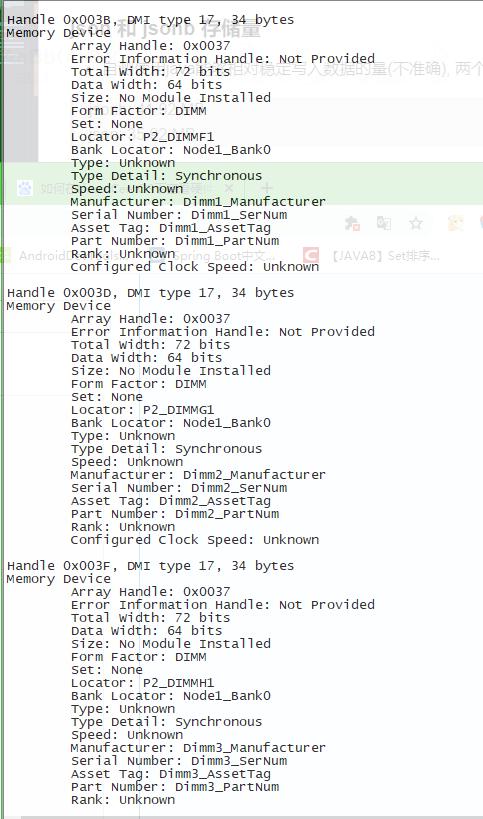
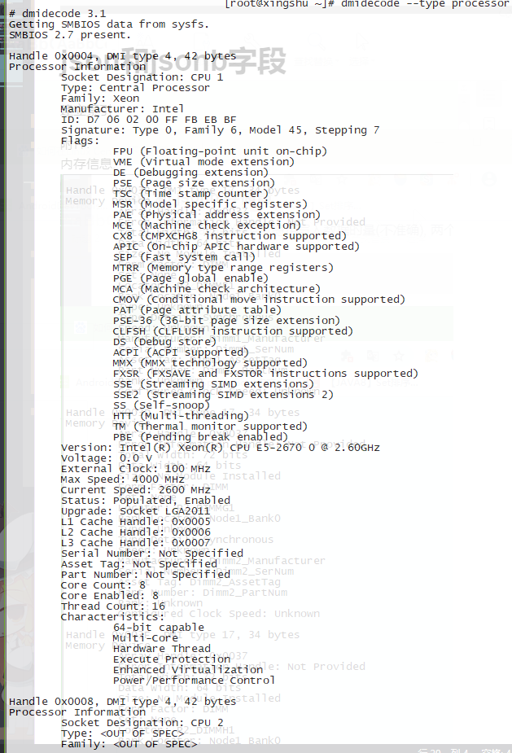

## postgreSQL中 json 和 jsonb 数据格式的性能分析

#### json 和 jsonb 存储量
自测使用java能够相对稳定写入数据的量(不准确), 两个相差不大, 如果数据量太大会卡住很久插入不成功
>jsonb:  41.92 MB = 42926.08kb
>json:  35.92 MB = 36782.08kb
#### 索引SQL语法
```sql
CREATE INDEX UFriendsRelation_UFID_index ON "UFriendsRelation" ("UFID");
-- UFriendsRelation_UFID_index 是索引名称,默认小写,不分大小写
DROP INDEX test1_id_index;
```

#普通字段


### 性能测试
>数据量 5102832, 510万 

未建立索引测试:
```sql
-- 测试sql在不建立索引之前,查询耗时 2s382,2s382,2s348,2s403
select * from "UFriendsRelation" order by "UFID" desc limit 1;
-- 查询耗时 4s48,4s58,4s113,4.93s
select * from "UFriendsRelation" where "UFID" = (select Max("UFID") "UFID" from "UFriendsRelation");
```
 建立索引之后(UID建立索引)
```sql
--查询耗时 83ms, 87ms, 88ms, 87ms, 85ms, 80ms, 84ms
select * from "UFriendsRelation" order by "UFID" desc limit 1;
--查询耗时 95ms, 93ms, 76ms, 76ms, 77ms, 84ms, 85ms
select * from "UFriendsRelation" where "UFID" = (select Max("UFID") "UFID" from "UFriendsRelation");
```

#json和jsonb字段
###性能测试
>数据量 5102832, 510万
+ 未建立索引
```sql
-- 查询单条记录 98ms,94ms,88ms,96ms,92ms,95ms
select * from "UFriendsRelationT" where "UFID" = 3000000;

-- 更新jsonb,每次更新追加1000个对象 sql 测试 260ms,103ms,89ms,120ms,92ms
update "UFriendsRelationT" set "UFriends" = "UFriends"||'[{"age": 2, "sex": true, "name": "格若曦"},...]' where "UFID" = 3000000;

-- 更新json,每次更新追加1000个对象 sql 测试 93ms,143ms,108ms,124ms,192ms
update "UFriendsRelationT" set "UGroupIds" = "UGroupIds"::jsonb||'[{"age": 2, "sex": true, "name": "格若曦"},...]'::jsonb where "UFID" = 3000000;

-- 插入jsonb 每次插入1000个对象 测试 149ms,121ms,126ms,155ms,150ms,133ms
INSERT INTO "UFriendsRelationT" ("UHashId", "UFriends", "UFCreateTime") VALUES ('100a3999987', '[{"age": 10, "sex": true, "name": "第福气"},...]', '2020-05-07 06:57:45.431149');

-- 插入json 每次插入1000个对象 测试 117ms,130ms,104ms,112ms,104ms,120ms
INSERT INTO "UFriendsRelationT" ("UHashId", "UGroupIds", "UFCreateTime") VALUES ('100a3999987', '[{"age": 10, "sex": true, "name": "第福气"},...]', '2020-05-07 06:57:45.431149');

-- 全表扫描查询 jsonb 耗时 查了16m20s154ms
select count(1) from(
    select "UFID" from "UFriendsRelationT" where "UFriends" @> '[{"age": 33, "sex": true, "name": "元xue_asdf"}]'::jsonb
                    )T1;
```

内存信息:

cup信息:
