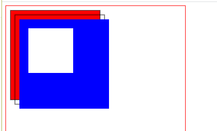

水滴动画(超逼真): https://www.html5tricks.com/demo/html5-canvas-rain-drop/index3.html

# canvas

> 绘制一条直线

```javascript
 	var canvas = document.getElementById("canvas");
    var cvsCtx = canvas.getContext("2d");
    //画一条直线
    cvsCtx.moveTo(0, 0);
    cvsCtx.lineTo(600, 600);
    //修改状态
    cvsCtx.strokeStyle = "red";
    cvsCtx.lineWidth = 5;
    //绘制
    cvsCtx.stroke();
```

> 绘制两个三角形, closePath(); 分区域,并将封闭路径

```javascript
//画一条直线
cvsCtx.beginPath();
cvsCtx.moveTo(200, 100);
cvsCtx.lineTo(100, 300);
cvsCtx.lineTo(300, 300);
cvsCtx.closePath();

//修改状态      
cvsCtx.fillStyle = "rgba(144,112,220,0.6)";
cvsCtx.fill();
cvsCtx.strokeStyle = "red";
cvsCtx.lineWidth = 5;
//绘制
cvsCtx.stroke();


//画一条直线
cvsCtx.beginPath();
cvsCtx.moveTo(10, 10);
cvsCtx.lineTo(100, 300);
cvsCtx.lineTo(300, 300);

//修改状态      
cvsCtx.fillStyle = "rgba(144,25,220,0.5)";
cvsCtx.fill();
cvsCtx.closePath();

cvsCtx.strokeStyle = "green";
cvsCtx.lineWidth = 5;
//绘制
cvsCtx.stroke();
```




```javascript
//第一个矩形
cvsCtx.rect(10, 10, 200, 200);
cvsCtx.fillStyle = "red";
cvsCtx.fill();
cvsCtx.stroke();
//第二个矩形
cvsCtx.strokeRect(20, 20, 200, 200);
//第三个矩形
cvsCtx.fillStyle = "blue";
cvsCtx.fillRect(30, 30, 200, 200);

//清除某个区域
cvsCtx.clearRect(50, 50, 100, 100);
```

> 曲线 http://blogs.sitepointstatic.com/examples/tech/canvas-curves/quadratic-curve.html
>
> http://blogs.sitepointstatic.com/examples/tech/canvas-curves/bezier-curve.html


> 圆形

```javascript
//圆形
cvsCtx.save();
cvsCtx.beginPath();
cvsCtx.translate(100, 100);
cvsCtx.arc(100, 100, 100, 0, Math.PI * 2, true);
cvsCtx.fillStyle = "pink";
cvsCtx.fill()
cvsCtx.closePath();
cvsCtx.restore();

cvsCtx.save();
cvsCtx.beginPath();
cvsCtx.translate(100, 100);
cvsCtx.arc(100, 100, 100, 0, Math.PI * 2, true);
cvsCtx.fillStyle = "pink";
cvsCtx.fill()
cvsCtx.closePath();
cvsCtx.restore();
```

