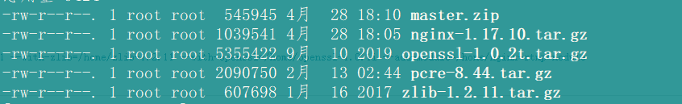

# nginx + nginx-rtmp 媒体服务器搭建
+ (微信小程序开发)  [组件: liver-pusher](https://developers.weixin.qq.com/miniprogram/dev/component/live-pusher.html)
+ 环境  nginx + nginx-rtmp-module + CentOS8
## 前序

##### 1.需求

  >微信小程序端,医疗软件,需要上传患者拍摄视频,拍摄时间大于一分钟

##### 2.调研结果

  >微信小程序提供了两个拍摄视频的接口,但是都不超过一分钟以上.但是小程序提供了直播推流的接口,通过调研发现,可以通过直播推流Live-push可以实现以上需求

##### 3.实现方法

  >使用live-push需要搭建媒体服务器. 以下是本人在搭建媒体服务器所采用的版本号,以及在搭建过程中所碰见的问题

##### 5.重点
>+ nginx 媒体服务器搭建,实现 推流,拉流的过程
>+ 媒体服务器权限认证

##### 4.媒体服务器搭建前须知.

  >微信小程序live-push需要使用公网IP地址才能访问, 如果其它的话视情况而定
  >使用微信小程序组件 live-pusher 和 live-player 需要开放固定的类目并申请权限


## 媒体服务器搭建过程

#### 1.实现思路:
 
>- 首先用户在录制视频的时候需要将流推向媒体服务器, 将流以m3u8的格式文件保存下来到一个临时路劲,这个临时路径中文件可以通过流的形式推送给客户
>- 但是这里做的是录制的视频,需要对文件进行永久保存. 所以在用户确保视频需要保存提交的时候需要对临时文件进行永久保存, 为了保持性能,以及程序的响应速度, 采用视频文件和永久存储的文件在一个盘中,当用户确保完成,可以将临时文件中的文件移动到永久目录中,这样不会对同样的文件进行重复的读写.速度也快

#### 2.搭建 nginx + nginx-rtmp-module + CentOS8:

##### 下载安装CentOS8 系统
>CentOS 版本 CentOS 8.1.1911    http://isoredirect.centos.org/centos/8/isos/x86_64/CentOS-8.1.1911-x86_64-dvd1.iso    我选择的是第一个阿里云下载的(下载完之后安装的时候默认选择安装桌面服务版本的,可以只安装server版本)  
总共7G,需要花几分钟的时间


##### 安装nginx 前工具包下载
>
net-tool 查本地IP
wget 下载安装包
unzip 解压zip包
gcc gcc-c++ perl 编译软件包用

```shell
yum install -y net-tools wget unzip gcc gcc-c++ perl
```

#### 安装nginx 和 rtmp包

```JSON
将当前目录切换的 /home 下
切换的homme目录
cd /home

如果是在虚拟机中,使用wget 连接失败,可以使用以下方法修改安装源
备份yum源
mv /etc/yum.repos.d/CentOS-Base.repo /etc/yum.repos.d/CentOS-Base.repo.backup
下载阿里源
wget -O /etc/yum.repos.d/CentOS-Base.repo http://mirrors.aliyun.com/repo/Centos-7.repo
清空缓存
yum makecache
```


#### 下载pcre包
下载地址 https://sourceforge.net/projects/pcre/files/pcre 可以选择版本,这里选择 /8.44/ 版本
```shell
wget https://sourceforge.net/projects/pcre/files/pcre/8.44/pcre-8.44.tar.gz
```

#### 下载 zlib 包
下载地址 http://www.zlib.net/ 可查看最新版本
```shell
wget http://www.zlib.net/zlib-1.2.11.tar.gz
```

#### 下载 openssl 包 
下载地址 wget https://www.openssl.org/source/
```shell
wget https://www.openssl.org/source/openssl-1.0.2t.tar.gz
```

### 下载 nginx-rtmp-module 包
下载地址 wget https://github.com/arut/nginx-rtmp-module
```shell
wget https://github.com/arut/nginx-rtmp-module/archive/master.zip
```

### nginx 下载
nginx 下载 http://nginx.org/en/download.html 这里我选择的是 1.17.10 版本 (nginx-1.17.10.tar.gz)
```shell
wget http://nginx.org/download/nginx-1.17.10.tar.gz
```

下载完成之后 如图:


### 解压文件

其中 master.zip 使用以下命令解压
```shell
unzip master.zip 
```
其它以 .tar.gz 结尾的使用以下命令解压
```shell
tar -zxvf xxxx.tar.gz
```
解压完成之后可以将压缩文件移除到其它目录,最终目录显示如下


### 编译文件
依次执行以下命令
```shell
cd openssl-1.0.2t       #切换目录

./config                #编译配置文件

make && make install    #编译并安装文件

cd nginx-1.17.10        #切换到 解压后的 nginx 目录下 执行以下命令, 配置 nginx

./configure --prefix=/usr/local/nginx --with-pcre=/home/pcre-8.44 --with-zlib=/home/zlib-1.2.11 --with-openssl=/home/openssl-1.0.2t --add-module=/home/nginx-rtmp-module-master

make && make install    #编译并安装, 如果执行完这个命令出现如下bug

```


使用以下解决方案

```shell
 make CFLAGS='-Wno-implicit-fallthrough'    #编译的时候执行该命令
 make install                               #安装 
```

### 检查是否安装成功

```shell
cd /usr/local/nginx     #切换到该目录
./sbin/nginx            #启动nginx
```

在浏览器中输入 ip 访问是否安装成功


### rtmp 配置

rtmp 各个属性详情配置请参考 https://github.com/arut/nginx-rtmp-module/wiki/Directives

```shell
worker_processes  1;
user root; #指定root用户,否则推流对文件没有写入的权限,也可以制定其它用户并设置文件读写的权限

error_log logs/error.log;   #错误日志输出
error_log  logs/error.log debug;    #错误日志输出修改 debug 模式, 可以查看推流和认证接口过程中出现的问题

pid logs/nginx.pid;

events {
    worker_connections  1024;
}

rtmp{
    server {  
        #监听推流端口
        listen 1935;  
        chunk_size 4096;

        #hls配置
        application hls {  
            live on;  
            hls on;
            wait_key on;
            hls_path /usr/data/video/hls; #推流文件存储的临时目录
            hls_nested on;
            hls_fragment 5s;
            hls_playlist_length 900s;
            hls_continuous on;

            notify_method get; # 设置认证接口请求方法为 get

            # 本地测试接口
            # on_publish http://localhost/media/auth;

            # 也可以使用其它接口进行认证,如果不需要认证, 注解掉即可,
            # 在推流之前,会请求该方法,如果返回状态为 200 则认证成功, 如果返回 500 则认证失败
            on_publish http://111.229.248.28:80/YCX/userInfo/authSessionKey;
        }
    }
}

http {
    autoindex on;
    include       mime.types;
    default_type  application/octet-stream;
    sendfile        on;
    keepalive_timeout  65;
    gzip  on;
    server {
        listen       8080;
        server_name  localhost;

        location / {
            root   html;
            index  index.html index.htm;
        }
        #### 配置m3u8临时文件读取
        location /hls {  
            types {  
                application/vnd.apple.mpegurl m3u8;  
                video/mp2t ts;  
            }  
            root /usr/data/video;  
            add_header Cache-Control no-cache;
        }
        error_page   500 502 503 504  /50x.html;
        location = /50x.html {
            root   html;
        }
    }
}
```

