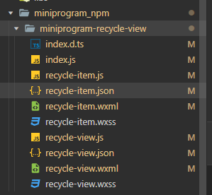
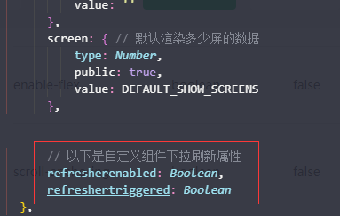
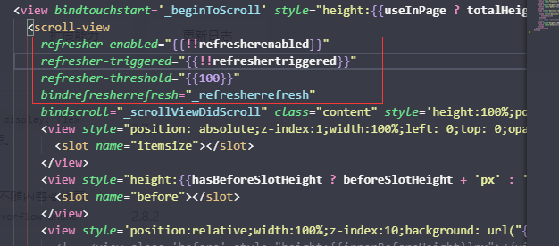
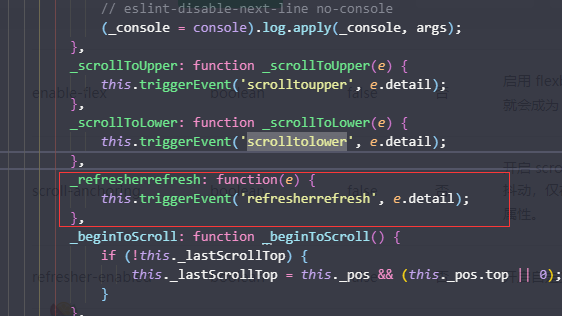
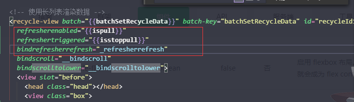

### 微信长列表组件 recycle-view 修改,使其可以下拉刷新
>微信的长列表组件能够很好的解决微信小程序大量数据渲染卡顿的问题
但是对下拉数据刷新的动态展示效果却很差

#步骤
1.在小程序对长列表组件 构建npm完成之后,文件目录如下图所示


2. 首先打开 recycle-view.js 文件在组件属性列表对象properties 中添加两个属性

```json
   // 以下是自定义组件下拉刷新属性
    refresherenabled: Boolean,
    refreshertriggered: Boolean
```

    

3.在 recycle-view.wxml 文件中 给组件 scroll-view 添加属性

```JSON
    refresher-enabled="{{!!refresherenabled}}"
    refresher-triggered="{{!!refreshertriggered}}"
    refresher-threshold="{{100}}"
    bindrefresherrefresh="_refresherrefresh"
```


4.在 recycle-view.js 文件中添加对应的方法




5.引用组件
```javascript
refresherenabled="{{ispull}}" //ispull 控制是否开启下拉刷新
refreshertriggered="{{isstoppull}}" //isstoppull 下拉刷新状态完成之后,结束下拉的状态
bindrefresherrefresh="_refresherrefresh"
```


